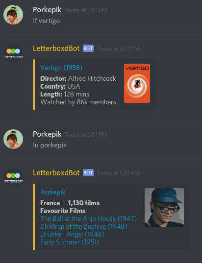
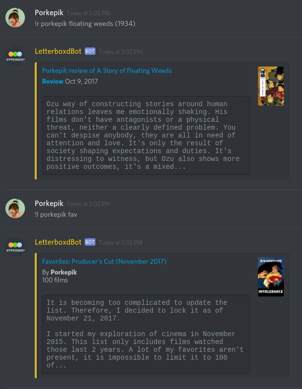
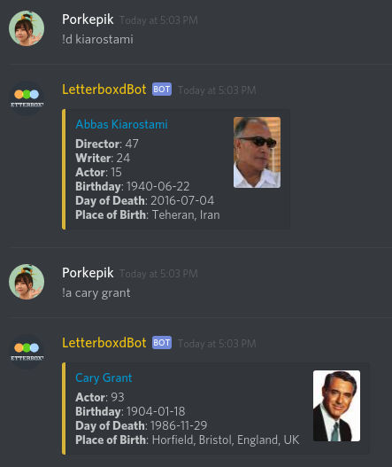

# Letterboxd Bot

This is a [Discord](https://discordapp.com/) bot for [Letterboxd](https://letterboxd.com/) requests such as getting the page of a film, crew person, user or review.

## Commands

**!helplb**

Display the commands with descriptions.

**!film/!movie/!f \<film-name> (\<year>)**

Search a film on Letterboxd and returns an embed link with informations.
A year can be specified in parentheses or with y:.  
Example: !film silence y:1971  
Returns the 1971's version, not giving a year would return the Scorsese remake.

**!director/!d/!actor/!a \<name>**

Search the specified person and returns an embed link with informations.

**!user/!u \<username>**

Returns an embed link to the Letterboxd member profile, displaying their featured favourites, location and number of films watched.

**!review/!r \<username> \<film-name> (\<year>)**

Returns the review or a list of reviews from the specified user and film. The year parameter of !film also works with this command.  
Example: !review porkepik floating weeds (1934)  
Returns Porkepik's review of A Story of Floating Weeds (1934)

**!list/!l \<username> \<list-name>**

Returns an embed of the list by the specified user.

**!checklb**

Checks if Letterboxd.com is down.

**!del**

Deletes the last message by the bot inside the channel. The bot needs the "manage messages" permission for this command to work.
